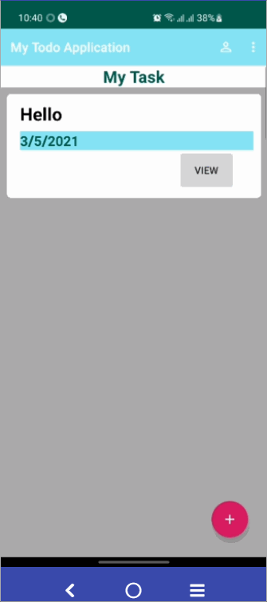
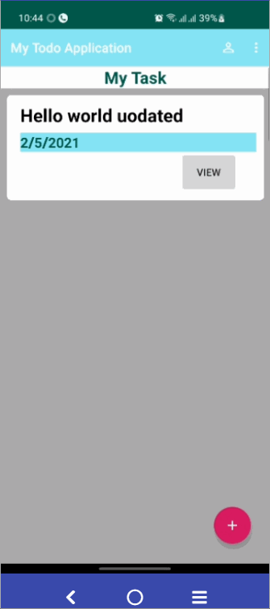

# Todo_c7202776
## Add task

## Delete Task

## Delete All

## Update Task

## About menu

## Refrence
https://github.com/binay-shah/android-todo

https://github.com/ebbi/TodoMVVM

https://github.com/binay-shah/todo_sec_a

https://developer.android.com/codelabs/android-training-activity-with-implicit-intent?fbclid=IwAR1PlkoOk-Kh1SFpcCwejIIvDu_csN5m1A0ggi04Gw73VsoEu5oFQJ1dXN4#5

https://www.journaldev.com/14207/android-passing-data-between-fragments

https://stackoverflow.com/questions/18865509/get-data-from-fragment-android

https://developer.android.com/codelabs/android-room-with-a-view#3
